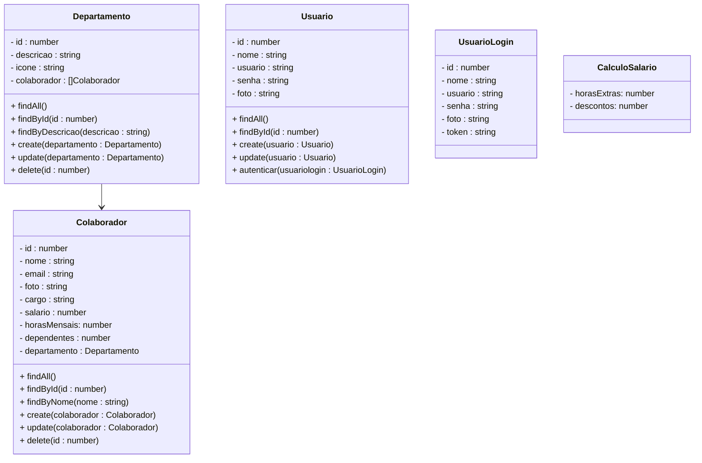

# Projeto RH - Backend

 

    

  

## 1. Descrição

Um sistema de Recursos Humanos (RH) é uma plataforma digital que auxilia empresas na gestão de seus funcionários e processos internos de RH, como recrutamento, administração de benefícios, controle de ponto, avaliação de desempenho, e treinamento. Esses sistemas são projetados para otimizar tarefas administrativas, facilitar o acesso a dados dos colaboradores e melhorar a comunicação entre equipes.

### 1.1. Principais Funcionalidades  de um sistema de RH

1. Recrutamento e Seleção de Colaboradores

2. Cadastro e Gerenciamento de Colaboradores

3. Gestão de Benefícios

4. Controle de Ponto e Jornada

5. Folha de Pagamento

6. Avaliação de Desempenho e Feedback

7. Relatórios e Indicadores de RH

------

## 2. Sobre esta API

Neste projeto, será desenvolvido um **Mínimo Produto Viável (MVP)** de um sistema de **RH**, implementando os CRUDs (Create, Read, Update, Delete) para os  principais registros de um sistema de RH. A solução  abrangerá as três entidades mais comuns em um sistema RH:

### 2.1. Principais Funcionalidades

1. Cadastro e gerenciamento de usuários
2. Registro e gerenciamento de departamentos
3. Criação e gerenciamento dos colaboradores
4. Cálculo do salário

### 2.2. Cálculo do  Salário Líquido

O cálculo do salário de um CLT envolve os seguintes principais componentes:

1. **Salário Base:** É o valor mensal acordado no contrato de trabalho.
2. **Adicionais:**
   - **Adicional de Insalubridade:** Percentual sobre o salário mínimo, caso o trabalho seja realizado em condições insalubres.
   - **Adicional de Periculosidade:** Percentual sobre o salário base, caso o trabalho envolva atividades perigosas.
   - **Horas Extras:** Valor pago por horas trabalhadas além da jornada normal, com acréscimos de 50% ou 100%, conforme legislação.
   - **Comissões:** Valores recebidos por vendas ou metas atingidas.
3. **Descontos:**
   - **INSS (Instituto Nacional do Seguro Social):** Percentual sobre o salário base, conforme faixa salarial.
   - **IR (Imposto de Renda):** Percentual sobre o salário base, conforme tabela progressiva.
   - **Vale Transporte:** Desconto de até 6% sobre o salário base.
   - **Vale Alimentação/Refeição:** Desconto conforme política da empresa.
   - **Faltas e Atrasos:** Descontos proporcionais aos dias não trabalhados.

Logo, o cálculo do holerite envolve somar os valores dos itens 1 e 2, e descontar os valores do item 3. O resultado final é o salário líquido que o funcionário irá receber. É importante ressaltar que o cálculo pode variar de acordo com a empresa, convenção coletiva e legislação aplicável.

- Para simplificar o nosso sistema, vamos utilizar apenas os seguintes atributos:

  - Salário Base

  - Horas Extras

  - INSS

  - IRRF

  - Descontos

- O Salário Base será persistido no Banco de dados
- As Horas Extras e os Descontos serão enviados para a API através da Classe Auxiliar **CalculoSalario**
- A  Classe Auxiliar **CalculoSalario** não irá gerar uma nova tabela no Banco de dados
- O valor que será pago pelas horas extras será calculado: `horasExtras * (valorHora * 1.5)`
- INSS e IRRF serão calculados através da Classe Utilitária **impostos**
- Abaixo, você confere a fórmula que será utilizada para calcular o salário liquido:

$$
salarioLiquido = (salario + salarioHorasExtras) - (inss + irrf + descontos)
$$

------

## 3. Diagrama de Classes

------

## 4. Diagrama Entidade-Relacionamento (DER)

    

------

## 5. Tecnologias utilizadas

| Item                          | Descrição  |
| ----------------------------- | ---------- |
| **Servidor**                  | Node JS    |
| **Linguagem de programação**  | TypeScript |
| **Framework**                 | Nest JS    |
| **ORM**                       | TypeORM    |
| **Banco de dados Relacional** | MySQL      |

------

## 6. Configuração e Execução

1. Clone o repositório
2. Instale as dependências: `npm install`
3. Configure o banco de dados no arquivo `app.module.ts`
4. Execute a aplicação: `npm run start:dev`

